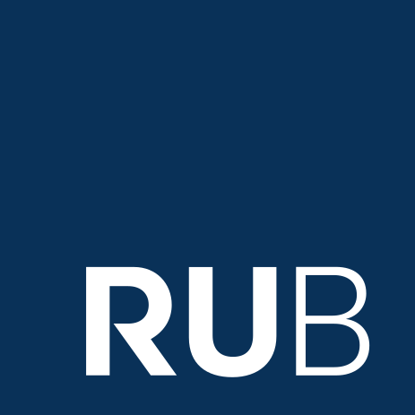
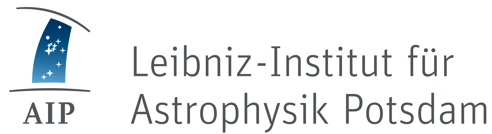
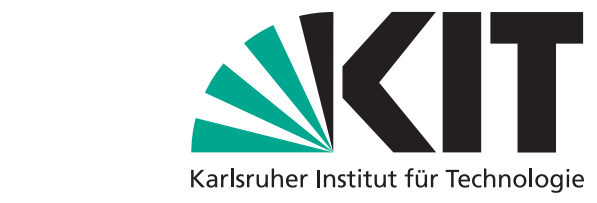
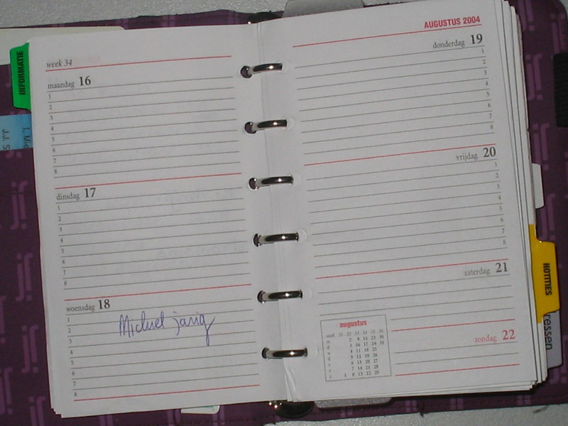
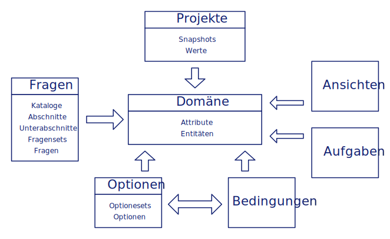

class: left, top
background-image: url(img/RUBtitleimage-4x3.jpg)

.logo[
    
]

## FDM an der RUB & Hands-On  RDMO 

### Johannes Frenzel

[AG Forschungsdatenmanagement](http://www.rub.de/researchdata)   

[Ruhr-Universität Bochum](http://www.rub.de)

??? 

---
Forschungsdatenmanagement an der RUB 
--------------------

#### Arbeitsgemeinschaft "AG FDM" 
* [IT.SERVICES](http://www.it-services.ruhr-uni-bochum.de/)   
* [Universitätsbibliothek](http://www.ub.ruhr-uni-bochum.de/)  

--
#### Rektoratsprojekt  (Mai 2017-April 2019)
 **Ziel**:  
 Etablierung eines zentral koordiniertem und nachhaltigem FDM 

--
* Sechs UseCases 
* Kooperation und Austausch: 
   UA Ruhr, DH-NRW, ...  
 

---
Aktuelle Schwerpunkte der AG FDM  
--------------------------------

--
#### Umfragen 
* UseCase SFB1280 und Kooperationspartner bei UNEKE

--
#### Forschungsdatenspeicher 
* Kooperation mit UA Ruhr, RWTH Aachen

--
#### Datenmanagementpläne (RDMO)
* Kooperation innerhalb UA Ruhr

--
#### Beratung: Antragstellung, Speicherung (Beginnt schon bei "Heisse Daten") 
 
???

---
Bündelung von Werkzeugen und Ressourcen 
---------------------------------------

#### Einstieg ins Datenmanagement (aktuell) 

1. Antragstellung (Dezernat 1.3 Forschung)
1. Datenmanagementpläne (HORIZON 2020, BMBF)
1. Forschungsdaten**speicher** (IT.SERVICES)
1. Publikation (Universitätsbibliothek)   

--
#### Ziel: Eine Plattform für alle Beteiligte und deren Prozesse 
* Standardisierung, Skalierbarkeit, Automatisierung, Schnittstellen 

--
#### Research Data Management Organizer ([RDMO](https://rdmorganiser.github.io/))

---
RDMO in der Erprobung
---------------------

#### Testinstanz von RDMO  
* Fragenkatalog sehr umfangreich
  * Hohe Einstiegsbarriere bei Nutzern  

--
#### RDMO Hands-On Workshop Bochum 2017  
  * Erstellung Fragenkatalog für Forscherteams

--
#### Kooperation und Interesse
  * FDM Teams (RDMO @ UA Ruhr), Usecase, DSB    

???
 (WissGrid Leitfaden und FAIR Data H2020 ) 
  * UA Ruhr Instanz
  * Erarbeitung von Fragen
  * Teilen von Katalogen 
  * Mehrwert
 ** nächste Folie 
---
Erhöhung des Mehrwerts von RDMO 
----

--
#### Abbildung von Prozessen 
* Massgeschneiderte Kataloge auf einer Domäne
* Arbeitsteilung beim Befüllen der Projektdaten
* Textuelle Ausgaben und Schnittstellen 

--
#### Wunschliste an RDMO 2. Projektphase  
* Kataloge: Rollenabhängig
* Projekte: Abbildung komplexerer Strukturen (Forscherverbünde, ...)   
 
???
* Abbildung von Prozessen 
    * Forschungsalltag: Datendokumentation, -organisation und -verwaltung  
    * Unterstützung: Anfragen an das zentrale FDM, Antragstellung, DMP  
* Arbeitsteilung beim Befüllen der Projektdaten
  * teilbefüllte Projekte, statt redundanter Dateneingabe 
  * Aufgaben für notwendige Schritte und Ansprechpartner 
* Textuelle Ausgaben
  * DMP, Datenschutz (DS-GVO), Textbausteine Antrag, 
  * Planung und Bereitstellung von FDM-Infrastruktur

 
---
RDMO
----
*live*

---
Anhang 
------------
---
Projekt RDMO
------------

  
  

* Gefördert von der Deutschen Forschungsgemeinschaft, Bereich LIS
* Projektlaufzeit von November 2015 - April 2017

  
  
  

* Nachfolgeprojekt bewilligt (30 Monate) 
  * Erweiterung des Organisers
  * Integration in Infrastruktur
  * Etablierung in der Community
  * Nachhaltigkeit / Verstetigung

---

RDMO - Vom Plan zum Organiser
-----------------------------

.agenda[
    
]

* Unterstützung des Datenmanagements über den  
  gesamten Projektverlauf
* Einbinden aller im Forschungsdatenmanagement  
  involvierten Akteure
* Erfassung aller relevanten Informationen für ein  
  nachhaltiges Datenmanagement
  * Strukturiertes Interview
  * Entscheidungsbaum, Überspringen redundanter Fragen
  * Ausgabe eines textuellen Datenmanagementplans
  * Ausgabe von anstehenden Aufgaben
  * Schnittstellen zu anderen Tools

.attribution[
    Image credit: <a href="https://en.wikipedia.org/wiki/nl:Gebruiker:Michiel1972">M.Minderhoud</a>, <a href="https://commons.wikimedia.org/wiki/File:Agenda.jpg">Agenda</a>, <a href="https://creativecommons.org/licenses/by-sa/3.0/legalcode">CC BY-SA 3.0</a>
]

---

RDMO Architektur
----------------

.architecture[
    
]

---

class: inverted

RDMO Tour Betreiberperspektive
-------------------------

* Fragen
  * Kataloge, Abschnitte und Unterabschnitte
  * Fragensets und Fragen
* Domäne
  * Attribute und Entitäten
  * Bereiche, Anzeigenamen, Optionen, Bedingungen
* Optionen und Optionensets
* Bedingungen
* Ansichten
* Aufgaben
---

class: inverted

RDMO Nutzerperspektive
----------------------

* Zugang per lokalem Account, Oauth, LDAP Anbindung, Shibboleth
* Strukturierung anhand von Projekten, Kollaboration
* Strukturiertes Interview
  * verschiedene Widgets, kontollierte Vokabulare, Hilfetexte, Navigation
  * Reiter für verschiedene Projektpartner, Förderer, Datensätze, etc.
  * Bedingungen und Überspringen von Fragen
* Anzeigen und Export der Antworten und von Ansichten
* Erstellen von Snapshots
* Anzeigen der Aufgaben
* Mehrsprachigkeit

---

Links
-----

Datenmanagementpläne

* [Data Management Pläne auf forschungsdaten.org](http://www.forschungsdaten.org/index.php/Data_Management_Pl%C3%A4ne)
* [Leitfaden zum Forschungsdaten-Management. Handreichungen aus dem WissGrid-Projekt](https://rdmorganiser.github.io/docs/Leitfaden_Data-Management-WissGrid.pdf)

Förderorganisationen

* [Guidelines on FAIR Data Management in Horizon 2020](http://ec.europa.eu/research/participants/data/ref/h2020/grants_manual/hi/oa_pilot/h2020-hi-oa-data-mgt_en.pdf)
* [Guidelines on Open Access to Scientific Publications and Research Data in Horizon 2020](http://ec.europa.eu/research/participants/data/ref/h2020/grants_manual/hi/oa_pilot/h2020-hi-oa-pilot-guide_en.pdf)
* [Guidelines on Data Management in Horizon 2020](http://ec.europa.eu/research/participants/data/ref/h2020/grants_manual/hi/oa_pilot/h2020-hi-oa-data-mgt_en.pdf)
* [DFG-Leitlinien zum Umgang mit Forschungsdaten](http://www.dfg.de/foerderung/antragstellung_begutachtung_entscheidung/antragstellende/antragstellung/nachnutzung_forschungsdaten/index.html)
